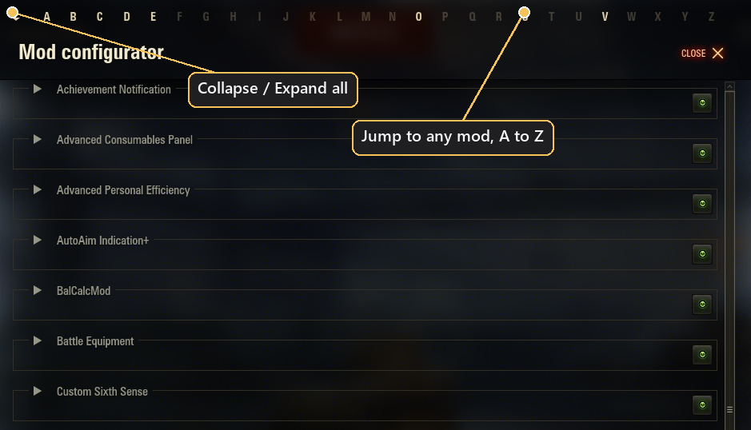
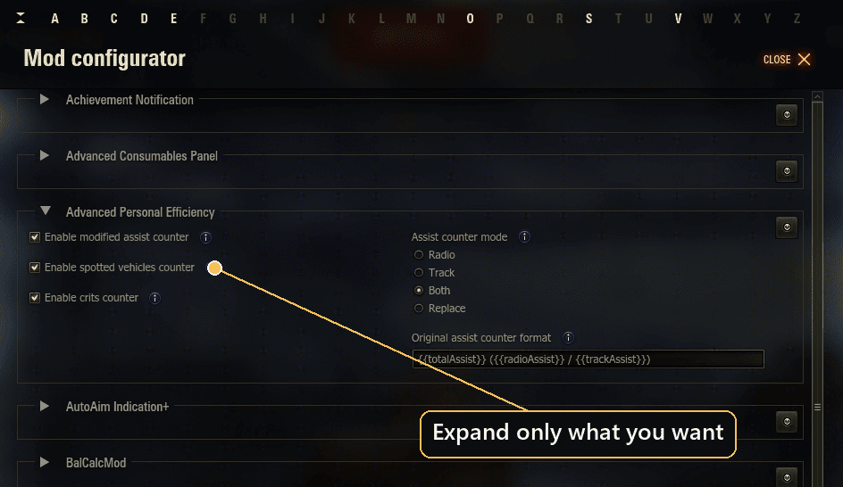
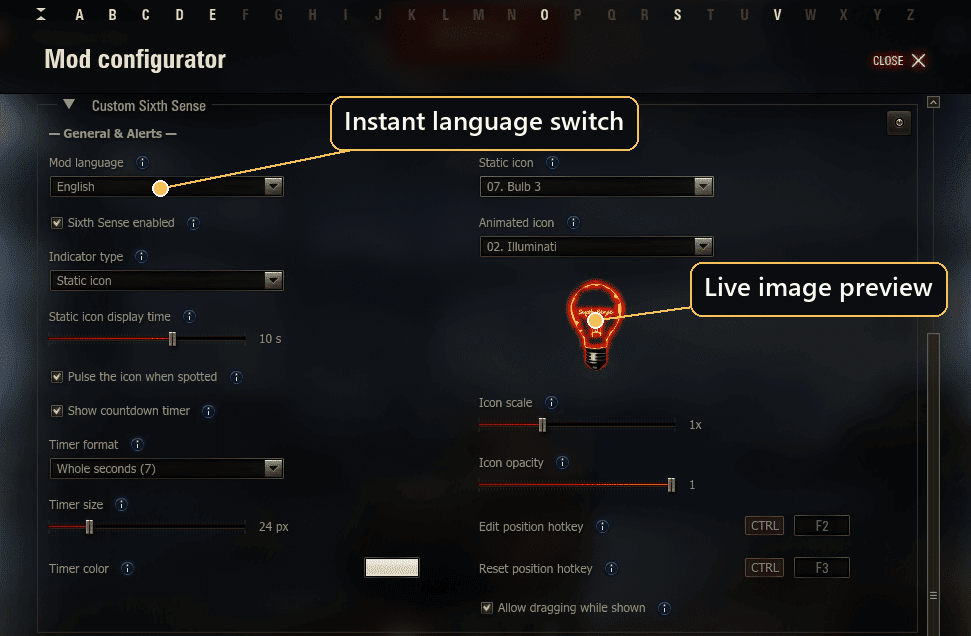
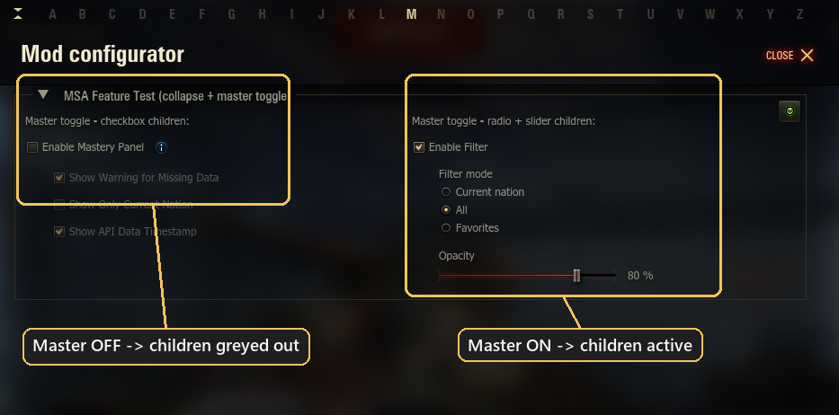

# Aslain's ModsSettings API

An enhanced fork of [izeberg's modsSettingsApi](https://github.com/izeberg/modssettingsapi), the in-garage settings menu for World of Tanks mods. It keeps the same template format and API, and adds features for navigating long mod lists and a richer settings UI.

It ships under its own package `gui.aslainMenu` with its own `aslainmenu.dat`, so it runs independently of izeberg and never touches izeberg's `modsettings.dat`. Mods import `gui.aslainMenu` (with a fallback to izeberg) to use this menu and its new features. In the hangar's mods list the menu appears as **"Mods settings+"** (localized), with a "+" badge on its icon.

## Enhancements over the original

- **Collapse / expand** each mod, plus a **Collapse All / Expand All** toolbar button, to keep a long settings list tidy.
- **A-Z quick-jump bar** above the list: click a letter to jump to the first mod with that initial.
- Mods list **sorted by display name** (case-insensitive), ignoring a leading badge or symbol before the name.
- **Grouped sub-options** via `templates.createControlsGroup(master, children)`: tie sub-controls to a master control so they are indented and **greyed-out / disabled while the master is off**, then enabled when it is on.
- **Value-conditional grey-out** via `templates.enableWhen(control, masterVarName, value)`: grey a control unless another control holds a given value (e.g. mutually-exclusive radio branches), updating live as the master changes — extends the master/child idea beyond a boolean On/Off.
- **`Image` component** (loaded via a plain `Loader` + `Bitmap`): render an image in the menu body, refresh it live with `updateImage(...)`, collapse its slot with `updateImage(..., removeImage=True)`, or start it collapsed via `createImage(..., collapsed=True)`. An optional built-in `label` (with `labelAlign`) renders above the image, collapses together with it and can be live-updated too. Image sources are plain root-relative paths resolved from the WoT root.
- **Live in-menu updates**: `registerLiveSettingsChange(...)` (per-linkage, optionally `mode='changedOnly'` to receive only the keys that changed) for uncommitted value changes; `reloadModTemplate(...)` re-renders one mod in place (e.g. instant language switch) without closing the window.

See [`CHANGELOG.md`](./CHANGELOG.md) for the full list, and [`docs/LIVE_MENU_UPDATES.md`](./docs/LIVE_MENU_UPDATES.md) for the live-update and image API.

## Screenshots









## Using it in your mod

Import the fork first, with a fallback to izeberg, so your mod also runs where only the original is installed. Importing `gui.aslainMenu` first means it wins when both are present:

```python
g_modsSettingsApi = None
templates = None
try:
    from gui.aslainMenu import g_modsSettingsApi, templates
except ImportError:
    pass
if g_modsSettingsApi is None:
    try:
        from gui.modsSettingsApi import g_modsSettingsApi, templates
    except ImportError:
        pass
```

The extra features (image previews, instant language switch, controls grouping) work when `gui.aslainMenu` is the one loaded. Feature-detect new methods with `hasattr(g_modsSettingsApi, ...)` so your mod still runs on older API builds. See [`examples/`](./examples) for full templates.

### Grouping sub-options

Tie sub-controls to a master control so they grey out while the master is off:

```python
templates.createControlsGroup(
    templates.createCheckbox('Enable feature', 'featureOn', True),
    [
        templates.createSlider('Intensity', 'intensity', 5, 1, 10, 1),
        templates.createCheckbox('Verbose logging', 'verbose', False),
    ],
)
```

### Value-conditional grey-out

`createControlsGroup` greys its children while a *boolean* master is Off. To grey a control unless a master holds a **specific value** - e.g. mutually-exclusive radio branches - use `enableWhen`, which updates live as the master changes:

```python
column = [
    templates.createRadioButtonGroup('Indicator', 'indicator', ['Static', 'Animated'], 0),
    # editable only while 'indicator' is on Static (value 0)
    templates.enableWhen(templates.createSlider('Hold time', 'holdTime', 5, 1, 15, 1),
                         'indicator', 0),
    # editable only while 'indicator' is on Animated (value 1)
    templates.enableWhen(templates.createDropdown('Animation', 'anim', ANIMS, 0),
                         'indicator', 1),
]
```

`value` may be a list to enable a control for several master values, and `indent=True`
indents it like a sub-option. `enableWhen` is aslainMenu-only - guard it with
`hasattr(templates, 'enableWhen')`; a control without the binding simply stays
always-enabled, so older API builds degrade gracefully.

### Staying compatible with plain izeberg

The import above lets your mod *run* on either menu, but the features below exist **only** on `gui.aslainMenu`. Calling them on plain izeberg raises an error (and can blank the whole settings window), so feature-detect each one with `hasattr(...)` and skip it when missing. A skipped control is simply left out of the template - no error, and no empty slot: the layout just closes up.

```python
column = [
    templates.createCheckbox('Sixth Sense enabled', 'enabled', True),
    templates.createDropdown('Icon', 'icon', ICON_NAMES, 0),
]

# createImage is aslainMenu-only -> add the preview only when available,
# otherwise it is simply omitted (no error, no empty gap).
if hasattr(templates, 'createImage'):
    column.append(templates.createImage('mods/configs/mymod/icons/%s.png' % ICON_NAMES[0],
                                        containerHeight=96, align='center',
                                        label='Preview', labelAlign='center'))

# createControlsGroup (grey-out sub-options under a master) is aslainMenu-only too.
master = templates.createCheckbox('Enable extras', 'extrasOn', True)
children = [templates.createSlider('Glow size', 'glow', 24, 8, 64, 1)]
if hasattr(templates, 'createControlsGroup'):
    column += templates.createControlsGroup(master, children)  # grouped + greyed when off
else:
    column += [master] + children                              # flat fallback on izeberg
```

Guard the singleton's new methods the same way, e.g. the live image preview:

```python
if hasattr(g_modsSettingsApi, 'updateImage'):
    g_modsSettingsApi.registerLiveSettingsChange(MOD_LINKAGE, onLiveChange)
    # inside onLiveChange call g_modsSettingsApi.updateImage(MOD_LINKAGE, 'icon', newSource)
```

**aslainMenu-only - guard before use:**

- `templates`: `createImage`, `createControlsGroup`, `enableWhen`
- `g_modsSettingsApi`: `updateImage`, `registerLiveSettingsChange` / `unregisterLiveSettingsChange`, `notifyLiveSettingsChange`, `reloadModTemplate`, `setModCollapsed`

## Dependencies

- [ModsList API](https://gitlab.com/wot-public-mods/mods-list) by poliroid, opens the settings window.
- [`net.openwg.gameface`](https://gitlab.com/openwg/wot.gameface), renders the menu UI.

## Build

See [`build.py`](./build.py) and [`build.json`](./build.json); build requirements are in [`requirements_build.txt`](./requirements_build.txt).

## Credits

- Original **ModsSettings API** by **izeberg (Renat Iliev)**, [izeberg/modssettingsapi](https://github.com/izeberg/modssettingsapi). All original credit and copyright remain with the author.
- **ModsList API** dependency by **poliroid**, [wot-public-mods/mods-list](https://gitlab.com/wot-public-mods/mods-list).
- This enhanced fork is maintained by **Aslain** ([aslain.com](https://aslain.com)). It adds the features listed above on top of izeberg's API, and does not remove or replace the original work.

See [`AUTHORS.md`](./AUTHORS.md).

## Contributing

Issues and pull requests welcome, especially new settings UI components and compatibility fixes.
