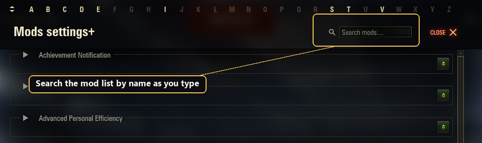

# Aslain's ModsSettings API

Aslain's ModsSettings API (Aslain Menu) — the in-garage settings menu for World of Tanks mods, based on [izeberg's modsSettingsApi](https://github.com/izeberg/modssettingsapi). It keeps the same template format and API, and adds features for navigating long mod lists and a richer settings UI.

It ships under its own package `gui.aslainMenu` with its own `aslainmenu.dat`, so it runs independently of izeberg and never touches izeberg's `modsettings.dat`. Mods import `gui.aslainMenu` (with a fallback to izeberg) to use this menu and its new features. In the hangar's mods list the menu appears as **"Mods settings+"** (localized), with a "+" badge on its icon.

## Enhancements over the original

- **Collapse / expand** each mod, plus a **Collapse All / Expand All** toolbar button, to keep a long settings list tidy.
- **A-Z quick-jump bar** above the list: click a letter to jump to the first mod with that initial.
- **Mod search**: a search box in the window header filters the mod list by name as you type — magnifier, an "×" clear button and a "Search mods" placeholder. Press **Ctrl+F** to focus it; matching mods are revealed (auto-expanded) and the list scrolls to them, and clearing it restores your view. Clicking an A-Z letter while a search is active clears it first, then jumps.
- **Per-mod reset**: a rotate icon below each mod's on/off switch (shown while the mod is expanded) restores that mod's options **and hotkeys** to their defaults. Dimmed when nothing differs from the defaults (or the mod is off), bright once something changes. Clicking it asks to confirm — a small dialog with the mod's name and **Reset** / **Cancel**, drawn on top inside the menu (localized in all 25 languages; skippable via the `resetSkipConfirm` user setting). On confirm the control reset is live (**Apply / OK** keeps it, **Cancel** reverts); hotkeys reset immediately; the mod's on/off state is never touched. Works automatically for every mod (no API call needed).
- Mods list **sorted by the shown name** (case-insensitive), ignoring a leading badge or symbol; a registered translation orders the mod under its translated name, and names not in the Latin alphabet (e.g. Cyrillic) sort after the Latin-named ones.
- **Grouped sub-options** via `templates.createControlsGroup(master, children)`: tie sub-controls to a master control so they are indented and **greyed-out / disabled while the master is off**, then enabled when it is on. Pass `indent=False` to keep the children un-indented (so a wide group doesn't crowd the second column).
- **Value-conditional grey-out** via `templates.enableWhen(control, masterVarName, value, condition='==')`: grey a control unless another control's value satisfies a condition — equality / list membership by default, or a comparison (`'!='`, `'>'`, `'>='`, `'<'`, `'<='`, e.g. master `>= 0`; also available as `CONDITION.*` aliases). Updates live as the master changes — extends the master/child idea beyond a boolean On/Off.
- **Hide instead of grey** via `templates.visibleWhen(...)`: the sibling of `enableWhen` with the same arguments, but it hides the control and reflows the mod (rows below close the gap) when the condition fails, instead of greying it in place — for options that make no sense in the current mode.
- **Multiple conditions (AND / OR)** via `templates.enableWhenAll` / `enableWhenAny` (plus `visibleWhenAll` / `visibleWhenAny`): gate a control on more than one master at once — `*All` requires every condition (AND), `*Any` requires at least one (OR).
- **`Image` component** (loaded via a plain `Loader` + `Bitmap`): render an image in the menu body, refresh it live with `updateImage(...)`, collapse its slot with `updateImage(..., removeImage=True)`, or start it collapsed via `createImage(..., collapsed=True)`. An optional built-in `label` (with `labelAlign`) renders above the image, collapses together with it and can be live-updated too. Image sources are plain root-relative paths resolved from the WoT root.
- **Sprite-sheet animation** in an `Image` slot: `createImage(atlas={...})` plays a looping animation from a single sheet the moment the menu opens, and `updateImageAtlas(...)` switches it live — one image blitted frame-by-frame (`copyPixels` on a timer) instead of hundreds of frame files, light even at a high `fps`.
- **Checkbox + colour picker on one row** via `templates.createCheckboxColor(text, varName, value, color, ...)`: a tick box with its label on the left and a colour swatch on the right, storing a `{'enabled': <bool>, 'color': <hex>}` pair under one name. A long label wraps onto extra lines under the checkbox without running under the swatch, and it slots into `enableWhen` / `visibleWhen` / `createControlsGroup` like any other control.
- **Live in-menu updates**: `registerLiveSettingsChange(...)` (per-linkage; pass `fullsettings=False` to receive only the changed keys instead of the full dict — the old `mode='changedOnly'` form is deprecated) for uncommitted value changes; `reloadModTemplate(...)` re-renders one mod in place (e.g. instant language switch) without closing the window — only the controls that actually changed are rebuilt, the rest reused in place.
- **Hotkey label float**: `templates.createHotkey(..., float='right')` wraps a long hotkey label around the keys (CSS-`float` style) — the keys float to the right and the label's overflow lines run full row width underneath them, instead of cramming into the narrow column. Default `'none'` keeps the original layout (plain-text labels only).
- **Plain-text labels**: pass `useHTML=False` to any `create*` control to render its label verbatim (so a literal `<` / `>` / `&` shows instead of being parsed as HTML markup), or `templates.escape(text)` to escape just a fragment of an otherwise-HTML label. Default `useHTML=True` keeps HTML labels (icons, `<font>`, `<b>`).
- **API version** for feature-gating: `g_modsSettingsApi.getVersion()` (string, e.g. `'1.2.0'`) and `getVersionTuple()` (e.g. `(1, 2, 0)` — compare this, not the string), plus the importable `VERSION` / `VERSION_TUPLE` constants, so a mod can adapt to the running API version (`if g_modsSettingsApi.getVersionTuple() >= (1, 2): ...`).
- **Translate another mod's menu** via `g_modsSettingsApi.registerModTranslation(linkage, mapping)`: supply a `{original string: replacement string}` dict and the API swaps those labels on the **copy** shown in the window — the target mod's stored template, saved values and code stay untouched (no settings reset). The API ships no translations itself; it is the hook an optional, separate localization mod uses to translate a mod whose menu is offered in only one language.

See [`CHANGELOG.md`](./CHANGELOG.md) for the full list, and [`docs/LIVE_MENU_UPDATES.md`](./docs/LIVE_MENU_UPDATES.md) for the live-update and image API.

## Screenshots




## Using it in your mod

Import Aslain's API first, with a fallback to izeberg, so your mod also runs where only the original is installed. Importing `gui.aslainMenu` first means it wins when both are present:

```python
g_modsSettingsApi = None
templates = None
try:
    from gui.aslainMenu import g_modsSettingsApi, templates
except ImportError:
    pass
if g_modsSettingsApi is None:
    try:
        from gui.modsSettingsApi import g_modsSettingsApi, templates
    except ImportError:
        pass
```

The extra features (image previews, instant language switch, controls grouping) work when `gui.aslainMenu` is the one loaded. Feature-detect new methods with `hasattr(g_modsSettingsApi, ...)` so your mod still runs on older API builds. See [`examples/`](./examples) for full templates.

### Cookbook (common recipes)

Compact copy-paste patterns; the sections below explain each in full. `CONDITION` is imported from `gui.aslainMenu`; feature-detect Aslain Menu-only calls with `hasattr(templates, ...)`.

```python
# Master checkbox with greyed-out children (returns a flat list to splice into a column)
column += templates.createControlsGroup(
    templates.createCheckbox('Enable group', 'grp', True),
    [templates.createSlider('Volume', 'vol', 5, 0, 10, 1)])

# Checkbox + colour picker on one row; stored value is {'enabled': bool, 'color': hex}
templates.createCheckboxColor('Damage numbers', 'dmg', True, 'F23030')
#   read in onModSettingsChanged: settings['dmg']['enabled'], settings['dmg']['color']

# Grey a control unless another control's value passes a test
templates.enableWhen(templates.createSlider('Fine tune', 'fine', 5, 1, 10, 1),
                     'level', 5, condition=CONDITION.GREATER_EQUAL)

# Hide + reflow instead of greying (shown only when mode == 1)
templates.visibleWhen(templates.createSlider('Advanced', 'adv', 5, 1, 10, 1), 'mode', 1)

# Dynamic spacer: blank vertical space that shows/hides with a master (no image needed)
templates.visibleWhen(templates.createEmpty(40), 'mode', 1)

# Gate on several masters at once: *All = AND, *Any = OR
conds = [{'varName': 'level', 'condition': CONDITION.GREATER_EQUAL, 'value': 5},
         {'varName': 'expert', 'value': True}]
templates.enableWhenAll(templates.createCheckbox('Pro option', 'pro', False), conds)

# Plain-text label - literal <, >, & shown verbatim (or templates.escape(text) for a fragment)
templates.createCheckbox('Warn when HP < 25%', 'hp', True, useHTML=False)

# Long hotkey label wrapped around the keys
templates.createHotkey('A long description for this hotkey', 'key', [Keys.KEY_F2], float='right')
```

### Versioning your template (`settingsVersion`)

The API stores each mod's template and the user's saved values between sessions. Add an integer `settingsVersion` to your template to control when a changed template is picked up:

```python
def buildTemplate():
    return {
        'modDisplayName': 'My Mod',
        'settingsVersion': 2,
        'column1': [ ... ],
    }
```

**Bump `settingsVersion` for any structural change** — adding, removing or retyping a control, changing a dropdown / radio / step-slider's set of options, or changing a slider / stepper's min / max / interval. A structural change is only adopted — and that mod's saved values reset to the new defaults — when `settingsVersion` goes up; if you don't bump it, the stored template is kept and the change doesn't show. **Cosmetic changes (an edited label or tooltip, a changed default value, or reordered controls) no longer need a bump** — they refresh in place, with the user's saved values preserved. The rules:

The rule is the same whether or not your template carries a `settingsVersion`:

- **Cosmetic change** (structure unchanged — label/tooltip text, a default value, or the order of controls differs) → the new template is adopted so it refreshes, and the user's saved values are **kept** (values are keyed by control name, so reordering controls is safe). No reset, no warning. This holds for any mod, including one with no `settingsVersion` and one adopting `settingsVersion` for the first time.
- **Structural change** (a control added, removed or retyped, a dropdown / radio / step-slider's options changed, or a slider / stepper's range changed) → it needs a bump. With `settingsVersion` present and **bumped**, the new template is adopted and the mod's saved values reset to the new defaults. With `settingsVersion` present but **not bumped**, the stored template and the user's values are kept and the change is ignored (and a warning is logged). A mod with **no `settingsVersion`** adopts a structural change and resets — the legacy behaviour.
- **First install** → the template is adopted and its defaults recorded.

If you make a **structural** change but keep the same `settingsVersion`, the API logs a warning to `python.log` (`[ModsSettings API] Template structure for '…' changed but settingsVersion was not bumped …`), so a forgotten bump is easy to spot during development. Cosmetic changes never warn — they just refresh.

### Grouping sub-options

Tie sub-controls to a master control so they grey out while the master is off:

```python
templates.createControlsGroup(
    templates.createCheckbox('Enable feature', 'featureOn', True),
    [
        templates.createSlider('Intensity', 'intensity', 5, 1, 10, 1),
        templates.createCheckbox('Verbose logging', 'verbose', False),
    ],
)
```

Pass `indent=False` to keep the children at the master's own indent instead of inset, so a wide group doesn't crowd the second column.

### Value-conditional grey-out

`createControlsGroup` greys its children while a *boolean* master is Off. To grey a control unless a master holds a **specific value** - e.g. mutually-exclusive radio branches - use `enableWhen`, which updates live as the master changes:

```python
column = [
    templates.createRadioButtonGroup('Indicator', 'indicator', ['Static', 'Animated'], 0),
    # editable only while 'indicator' is on Static (value 0)
    templates.enableWhen(templates.createSlider('Hold time', 'holdTime', 5, 1, 15, 1),
                         'indicator', 0),
    # editable only while 'indicator' is on Animated (value 1)
    templates.enableWhen(templates.createDropdown('Animation', 'anim', ANIMS, 0),
                         'indicator', 1),

    templates.createSlider('Count', 'count', 0, 0, 10, 1),
    # comparison, not just equality: editable only while 'count' is >= 3
    templates.enableWhen(templates.createCheckbox('Extra option', 'extra', False),
                         'count', 3, condition=CONDITION.GREATER_EQUAL),
]
```

`condition` compares instead of matching: `'=='` (default), `'!='`, `'>'`, `'>='`, `'<'`, `'<='`. The `CONDITION` constants are aliases for these (`CONDITION.EQUAL`, `CONDITION.GREATER_EQUAL`, …) — import with `from gui.aslainMenu import templates, CONDITION`, or just pass the raw string. With `'=='`, `value` may be a list to enable for several master values. `indent=True` indents the control like a sub-option. `enableWhen` is aslainMenu-only - guard it with `hasattr(templates, 'enableWhen')`; a control without the binding simply stays always-enabled, so older API builds degrade gracefully.

### Hiding instead of greying (`visibleWhen`)

`visibleWhen` takes the same arguments as `enableWhen`, but when the condition fails it **hides** the control and reflows the mod (the rows below move up to close the gap) instead of greying it out in place. Use it for options that make no sense in the current mode:

```python
column = [
    templates.createDropdown('Mode', 'mode', ['Simple', 'Advanced'], 0),
    # shown only while 'mode' is on Advanced (value 1); hidden otherwise
    templates.visibleWhen(templates.createSlider('Advanced tuning', 'tuning', 5, 1, 10, 1),
                          'mode', 1, indent=True),
]
```

Guard it with `hasattr(templates, 'visibleWhen')`. On older API builds it falls back to greying (the hide flag is ignored), so the control still gates correctly.

`visibleWhen` works on any component, including `templates.createEmpty(height)` — a gated empty is a **dynamic spacer** (blank vertical space that appears/disappears and reflows the column), with no image needed. `createEmpty()` defaults to a 20px gap; pass any height.

### Gating on several masters (`enableWhenAll` / `enableWhenAny`)

To gate a control on more than one master at once, use `enableWhenAll` (every condition must hold — logical AND) or `enableWhenAny` (at least one — logical OR). Each takes a list of condition dicts `{'varName', 'value', 'condition'}`; `condition` defaults to `'=='`, and omitting `'value'` tests that a boolean master is On:

```python
conditions = [
    {'varName': 'level', 'condition': CONDITION.GREATER_EQUAL, 'value': 5},
    {'varName': 'expertMode', 'value': True},
]
# enabled only while level >= 5 AND expertMode is on
templates.enableWhenAll(templates.createSlider('Fine tune', 'fine', 5, 1, 10, 1), conditions)
# enabled while level >= 5 OR expertMode is on
templates.enableWhenAny(templates.createCheckbox('Shortcut', 'shortcut', False), conditions)
```

`visibleWhenAll` / `visibleWhenAny` work the same way but hide the control (like `visibleWhen`) instead of greying it. Feature-detect with `hasattr(templates, 'enableWhenAll')`; older builds leave the control always-enabled.

### Checkbox with a colour picker (`createCheckboxColor`)

`createCheckboxColor` puts a checkbox and a colour picker on one row: the tick box and its label on the left, the colour swatch on the right. It stores both halves under one `varName` as a dict, so a single setting carries an on/off flag and a colour together:

```python
templates.createCheckboxColor('Damage numbers', 'dccDmg', True, 'F23030', tooltip=tip)
```

The stored value is `{'enabled': <bool>, 'color': <hex str>}` (colour without the leading `#`), so read it like this:

```python
def onModSettingsChanged(self, linkage, settings):
    on = settings['dccDmg']['enabled']
    colour = settings['dccDmg']['color']
```

A long label wraps onto extra lines under the checkbox without ever running under the swatch (the box, the first line and the tooltip icon stay on a real checkbox, so clicking toggles with the usual sound). It works as both a gated control and a gating master in `enableWhen` / `visibleWhen` (as a master it gates on its `enabled` flag), and inside `createControlsGroup`. Feature-detect with `hasattr(templates, 'createCheckboxColor')`.

### Wrapping a long hotkey label

A long hotkey label wraps into the narrow column to the left of the keys by default. Pass `float='right'` to wrap it *around* the keys instead (CSS-`float` style) - the keys stay on the right and the overflow lines run the full row width underneath, so a long description reads naturally:

```python
templates.createHotkey(
    'A long description for this hotkey that reads better flowing under the keys',
    'myKey', [Keys.KEY_BACKSPACE, KEY_CONTROL], float='right')
```

`float='none'` (default) keeps the narrow-column wrap. Plain-text labels only (a label with HTML markup keeps the narrow layout). Older API builds ignore the arg, so it degrades gracefully.

### Literal text in labels (`useHTML=False`)

Menu labels render as HTML, so a literal `<`, `>` or `&` in label text is parsed as markup — a checkbox labelled `Warn when HP < 25%`, for example, shows up as just `Warn when HP `, because everything from the `<` on is read as an (unclosed) tag. The cleanest fix is `useHTML=False`, accepted by every `create*` control, which renders that control's whole label as plain text:

```python
templates.createCheckbox('Warn when HP < 25%', 'hpWarn', True, useHTML=False)
templates.createSlider('Spread < 0.10', 'spread', 5, 0, 20, 1, useHTML=False)
```

Default `useHTML=True` keeps full HTML support (icons, `<font color=...>`, `<b>`). It is a keyword argument, so older API builds reject it — gate it on the API version (or wrap the call in `try` / `except TypeError`):

```python
kw = {'useHTML': False} if g_modsSettingsApi.getVersionTuple() >= (1, 3) else {}
templates.createCheckbox('Warn when HP < 25%', 'hpWarn', True, **kw)
```

To escape just a *fragment* of an otherwise-HTML label, `templates.escape(text)` returns the text with `&`, `<`, `>` escaped (feature-detect with `hasattr(templates, 'escape')`):

```python
templates.createLabel(templates.escape(userName) + " <font color='#80D639'>online</font>")
```

Both only affect how literal text *displays* — neither has anything to do with gating. The `condition` in `enableWhen(control, varName, value, condition='<=')` is a separate feature.

### Staying compatible with plain izeberg

The import above lets your mod *run* on either menu, but the features below exist **only** on `gui.aslainMenu`. Calling them on plain izeberg raises an error (and can blank the whole settings window), so feature-detect each one with `hasattr(...)` and skip it when missing. A skipped control is simply left out of the template - no error, and no empty slot: the layout just closes up.

```python
column = [
    templates.createCheckbox('Sixth Sense enabled', 'enabled', True),
    templates.createDropdown('Icon', 'icon', ICON_NAMES, 0),
]

# createImage is aslainMenu-only -> add the preview only when available,
# otherwise it is simply omitted (no error, no empty gap).
if hasattr(templates, 'createImage'):
    column.append(templates.createImage('mods/configs/mymod/icons/%s.png' % ICON_NAMES[0],
                                        containerHeight=96, align='center',
                                        label='Preview', labelAlign='center'))

# createControlsGroup (grey-out sub-options under a master) is aslainMenu-only too.
master = templates.createCheckbox('Enable extras', 'extrasOn', True)
children = [templates.createSlider('Glow size', 'glow', 24, 8, 64, 1)]
if hasattr(templates, 'createControlsGroup'):
    column += templates.createControlsGroup(master, children)  # grouped + greyed when off
else:
    column += [master] + children                              # flat fallback on izeberg
```

Guard the singleton's new methods the same way, e.g. the live image preview:

```python
if hasattr(g_modsSettingsApi, 'updateImage'):
    g_modsSettingsApi.registerLiveSettingsChange(MOD_LINKAGE, onLiveChange)
    # inside onLiveChange call g_modsSettingsApi.updateImage(MOD_LINKAGE, 'icon', newSource)
```

To gate on a feature level, read the running API version (guard the call — older builds don't provide it). Compare the tuple form, never the string:

```python
getVer = getattr(g_modsSettingsApi, 'getVersionTuple', None)
apiVersion = getVer() if getVer else (0, 0, 0)
if apiVersion >= (1, 2):
    g_modsSettingsApi.registerLiveSettingsChange(MOD_LINKAGE, onLiveChange, fullsettings=False)
```

**aslainMenu-only - guard before use:**

- `templates`: `createImage` (incl. `atlas=`), `createControlsGroup`, `createCheckboxColor`, `enableWhen` / `visibleWhen`, `enableWhenAll` / `enableWhenAny` / `visibleWhenAll` / `visibleWhenAny`, `escape`
- `g_modsSettingsApi`: `updateImage`, `updateImageAtlas`, `registerLiveSettingsChange` / `unregisterLiveSettingsChange`, `notifyLiveSettingsChange`, `reloadModTemplate`, `setModCollapsed`, `getVersion` / `getVersionTuple`, `registerModTranslation`

## Dependencies

- [ModsList API](https://gitlab.com/wot-public-mods/mods-list) by poliroid, opens the settings window.
- [`net.openwg.gameface`](https://gitlab.com/openwg/wot.gameface), renders the menu UI.

## Build

See [`build.py`](./build.py) and [`build.json`](./build.json); build requirements are in [`requirements_build.txt`](./requirements_build.txt).

## Credits

- Original **ModsSettings API** by **izeberg (Renat Iliev)**, [izeberg/modssettingsapi](https://github.com/izeberg/modssettingsapi). All original credit and copyright remain with the author.
- **ModsList API** dependency by **poliroid**, [wot-public-mods/mods-list](https://gitlab.com/wot-public-mods/mods-list).
- Aslain's ModsSettings API is maintained by **Aslain** ([aslain.com](https://aslain.com)). It adds the features listed above on top of izeberg's API, and does not remove or replace the original work.

See [`AUTHORS.md`](./AUTHORS.md).

## Contributing

Issues and pull requests welcome, especially new settings UI components and compatibility fixes.
